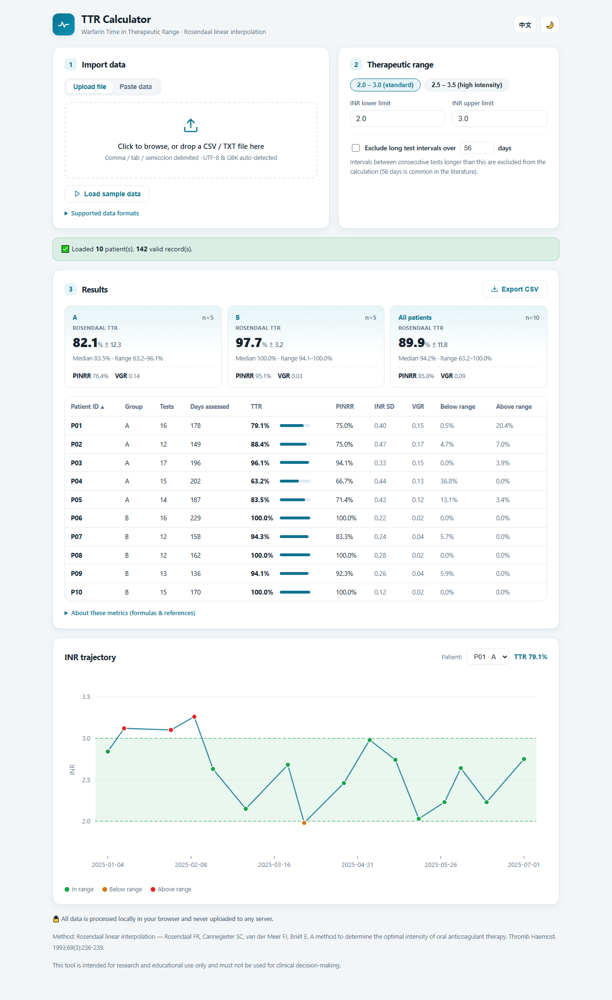
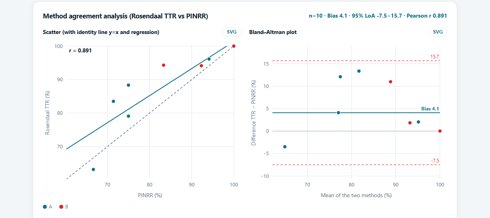

# TTR Calculator

A browser-based Warfarin **Time in Therapeutic Range (TTR)** calculator using the Rosendaal linear interpolation method. All computation happens locally in your browser — no data ever leaves your machine.

**Live demo:** https://xuxiaobogit.github.io/ttr-calculator/
&nbsp;·&nbsp; **One-click sample:** https://xuxiaobogit.github.io/ttr-calculator/?demo=1



## Features

- 📄 **Flexible import** — drag & drop a CSV / TXT file, or paste rows straight from Excel. UTF‑8 and GBK encodings, plus comma / tab / semicolon delimiters, are auto‑detected.
- 👥 **Batch by patient and group** — computes many patients and groups at once; a single patient with just two columns (date, INR) also works.
- 📊 **Multiple algorithms side by side** — for every patient and group it reports the **Rosendaal TTR** (time-based), **PINRR** (proportion of tests in range, count-based), **INR SD**, and the **Fihn variance growth rate (VGR)** of INR stability — so you can see directly how the methods diverge on the same data. Plus time below / above range, days assessed, and per-group summaries (mean ± SD, median, range).
- 📈 **Interactive INR trajectory chart** — the therapeutic window is shaded, and each measurement is colored by whether it falls in / below / above range.
- 🔬 **Method-agreement analysis** — a **scatter plot** (with identity line and regression, Pearson *r*) and a **Bland–Altman plot** (bias ± 95% limits of agreement) comparing Rosendaal TTR against PINRR, with points colored by group. Every figure exports to **standalone SVG** for direct use in a manuscript.
- ⚙️ **Configurable range** — presets (2.0–3.0 / 2.5–3.5) or custom limits; optionally exclude over‑long testing intervals (default threshold 56 days).
- 💾 **One‑click CSV export** — results open directly in Excel.
- 🌐 **Bilingual UI (English / 中文) and light / dark themes.**
- 🔒 **Zero‑dependency single file** — everything runs client‑side; no data is uploaded to any server.

## Data format

One INR record per line; the layout is detected automatically from the number of columns:

| Columns | Layout |
| --- | --- |
| 4 | `PatientID, Group, DateTime, INR` |
| 3 | `PatientID, DateTime, INR` |
| 2 | `DateTime, INR` (single patient) |

Dates such as `2023-08-19 14:30`, `2023/8/19`, and `8/19/2023 0:05` are accepted (`x/y/year` is read as month/day/year).

Example:

```csv
PatientID,Group,DateTime,INR
P01,A,2025-01-06 09:00,1.85
P01,A,2025-01-20 09:30,2.40
P02,B,2025-01-08 08:15,3.10
```

## URL parameters

The demo link supports a few query parameters for sharing a preconfigured view:

| Parameter | Values | Effect |
| --- | --- | --- |
| `demo` | any | Auto-loads the built-in sample dataset |
| `lang` | `en` / `zh` | Sets the interface language |
| `theme` | `light` / `dark` | Sets the color theme |

Example: `?demo=1&lang=en&theme=light`

## Metrics & methods

| Metric | Definition | Type |
| --- | --- | --- |
| **TTR (Rosendaal)** | Linear interpolation between consecutive INRs; percentage of **time** in range | Time-based |
| **PINRR** | In-range INR **tests** ÷ total tests × 100% (the "traditional" method) | Count-based |
| **INR SD** | Sample standard deviation of the patient's INR values | Variability |
| **VGR (Fihn)** | Mean over intervals of (ΔINR)² ÷ weeks between tests; higher = less stable | Variability |

The Rosendaal TTR interpolates INR linearly between measurements and allocates time in range; intervals longer than the optional gap threshold are excluded from both the numerator and the denominator. TTR and PINRR frequently differ on the same dataset, and INR-variability metrics (SD, VGR) have been shown to predict bleeding and thromboembolism independently of TTR.

The built-in **method-agreement analysis** makes that divergence explicit — a scatter plot against the identity line and a Bland–Altman plot of Rosendaal TTR vs PINRR:



**References**

- Rosendaal FR, Cannegieter SC, van der Meer FJ, Briët E. A method to determine the optimal intensity of oral anticoagulant therapy. *Thromb Haemost.* 1993;69(3):236‑239.
- Fihn SD, McDonell M, Martin D, et al. Risk factors for complications of chronic anticoagulation. *Ann Intern Med.* 1993;118(7):511‑520. (introduces the variance growth rate)
- Lind M, et al. The clinical evaluation of INR variability and control in conventional oral anticoagulant administration by use of the variance growth rate. *J Thromb Haemost.* 2013;11(8):1540‑1546. (VGR methods A/B1/B2)
- Bland JM, Altman DG. Statistical methods for assessing agreement between two methods of clinical measurement. *Lancet.* 1986;327(8476):307‑310.

## Disclaimer

For research and educational use only; not intended for clinical decision-making.

## License

MIT
